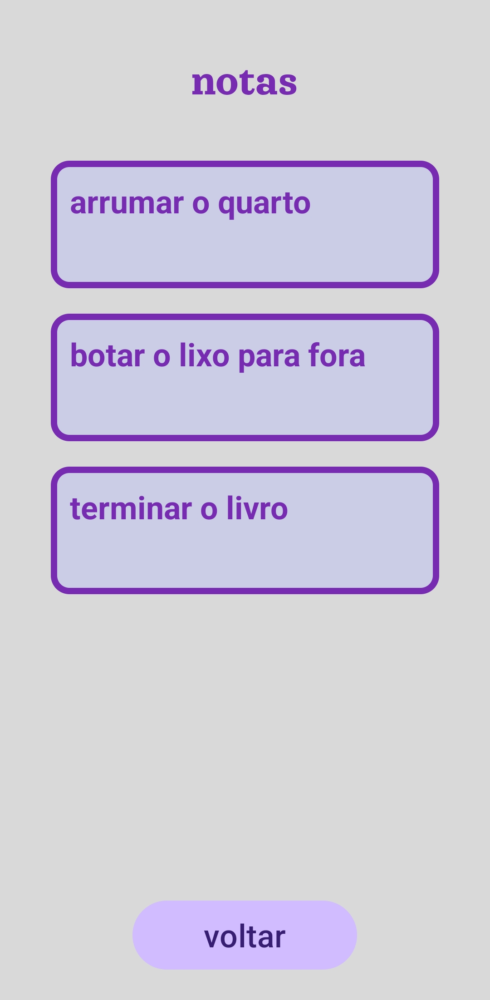
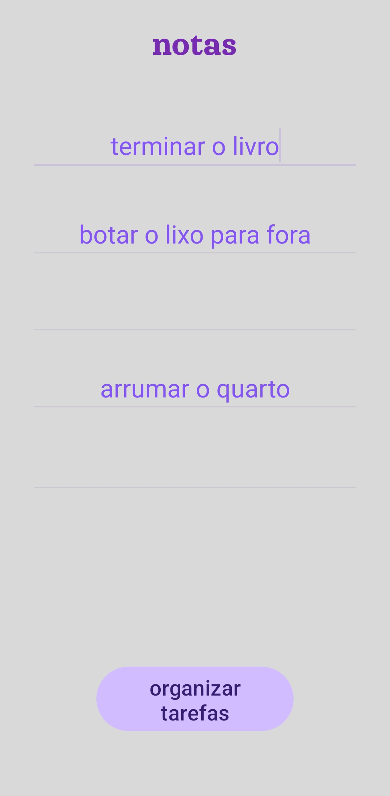

# Aplicativo notas da atividade N2
### Aplicativo que organiza notas  

Escreva a mensagem e clique em organizar notas, o app vai organiza-las em ordem alfabética.  
Feito em Java usando uma RecyclerView  

#### Prints do aplicativo :  

  
  

